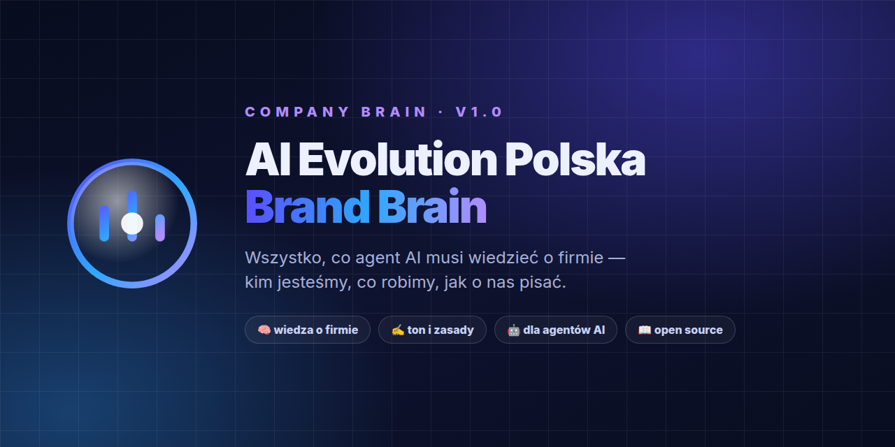

<div align="center">



# 🧠 AI Evolution Polska — Brand Brain

**Kompletna wiedza o firmie dla agentów AI.**

Kto jesteśmy · czym się zajmujemy · komu uczymy · jak o nas pisać · czego nigdy nie robić.

[](LICENSE)
[](BRAND.md)
[](BRAND.md)
[](agent/AGENTS.md)

</div>

---

## 🎯 Co to jest

**To jest mózg firmy.** Publiczne źródło prawdy, po który sięga agent AI,
zanim napisze post, ofertę, maila albo wygeneruje grafikę dla marki.

> **Zamiast tłumaczyć markę agentowi za każdym razem — klonujesz repo i agent już wie.**

| | |
|---|---|
| **Kto jesteśmy** | polska marka edukacyjna — uczymy AI od zera, bez żargonu |
| **Co robimy** | kursy online, warsztaty, szkolenia dla firm, społeczność |
| **Komu uczymy** | przedsiębiorcy, marketerzy, programiści, firmy |
| **Nasza obietnica** | każdy może zacząć używać AI **dzisiaj**, nie za rok |

---

## 🚀 Podłącz w 30 sekund

```bash
git clone https://github.com/aievolutionpl/brand-brain.git
```

**Claude Code / Cursor / dowolny agent — dwa pliki:**

```bash
cp brand-brain/BRAND.md       ./BRAND.md
cp brand-brain/agent/AGENTS.md ./AGENTS.md
```

**Gotowe.** Agent zna teraz firmę, głos, ceny i zasady. Nie musisz go prosić o kontekst.

<details>
<summary><b>🤖 Dodaj jako skill (Hermes / Claude Skills)</b></summary>

```bash
cp brand-brain/agent/SKILL.md ~/.claude/skills/ai-evolution-polska-brand/SKILL.md
```

Skill aktywuje się przy każdej prośbie o content dla AI Evolution Polska.
</details>

---

## 📦 Co jest w środku

| Plik | Zawartość |
|:---:|---|
| **[`BRAND.md`](BRAND.md)** | ⭐ **zacznij tutaj** — kompletna marka w jednym pliku |
| **[`docs/VOICE.md`](docs/VOICE.md)** | jak mówimy · zakazane sformułowania · CTA |
| **[`docs/AUDIENCE.md`](docs/AUDIENCE.md)** | 5 segmentów i co mówimy każdemu z nich |
| **[`docs/OFFER.md`](docs/OFFER.md)** | produkty, usługi i **realny cennik** |
| **[`docs/TOOLS.md`](docs/TOOLS.md)** | 13 narzędzi, o których mówimy |
| **[`docs/CLIENTS.md`](docs/CLIENTS.md)** | case studies i branże |
| **[`agent/AGENTS.md`](agent/AGENTS.md)** | 8 zasad twardych dla agentów |
| **[`agent/SKILL.md`](agent/SKILL.md)** | gotowy skill do wgrania |
| **`brand/`** | logo, cover i materiały marki |

---

## ⚠️ Najczęstszy błąd — nie mieszaj marek

**AI Evolution Polska** i **AI Evolution Labs** to **dwa różne biznesy.**

| | **AI Evolution Polska** | **AI Evolution Labs** |
|---|---|---|
| **Domena** | `aievolutionpolska.pl` | `aievolutionlabs.io` |
| **Co sprzedaje** | wiedzę, kursy, społeczność | agentów AI, marketing, usługi B2B |
| **Odbiorca** | chce się **nauczyć** | firma **wdraża** AI |

Post o budowaniu agenta AI za kilka tysięcy **nie pojawi się** na profilu edukacyjnym.

> 🚫 **`aievolution.pl` to zaparkowana domena — nie jest nasza. Nie linkuj jej.**

---

## 🛡️ Zasady, które agent musi znać

1. **Zero zmyślonych liczb.** Benchmark, cena, data — tylko ze źródła.
2. **Nie mieszaj AIEP z AI Evolution Labs.**
3. **Linkuj tylko 3 domeny** — patrz tabela wyżej.
4. **Fonty muszą mieć polskie diakrytyki.** Orbitron i Montserrat **nie mają** litery „ć".
5. **Logo, robot i wizerunek foundera — nigdy AI-redraw.**
6. **Obcięcia mierzysz kodem, nie wzrokiem** — narzędzia wizyjne zgłaszają fałszywe obcięcia.
7. **Dla firm poza IT:** prosty język, zysk i konkret — nie technologia.
8. **To repo jest publiczne** — nigdy danych klientów ani wewnętrznych materiałów.

---

## 🎨 Identyfikacja

| | |
|---|---|
| **Tagline** | Ucz się AI mądrzej. Buduj szybciej. |
| **Kolory** | Navy `#0E1330` · Indigo `#5B4DFF` · Blue `#2FA8FF` · Violet `#B18CFF` |
| **Fonty** | Inter · Manrope · DM Serif Display |
| **Social** | 1080×1350 (4:5) · Reels 1080×1920 (9:16) |

---

## 🌐 Nasze strony

| Domena | Rola |
|---|---|
| **aievolutionpolska.pl** | strona marki + blog |
| **ai-evolution.online** | darmowy kurs AI od podstaw |
| **aievolutionlabs.io** | AI Evolution Labs — agencja AI |

---

## 📄 Licencja

MIT — możesz używać, zmieniać i zaczepiać się z tego. Pod warunkiem, że **nie wyciągniesz**
tego repo do klienta, który ma z nami konflikt. 😄

---

<div align="center">

**Chris, CEO** · [aievolutionpolska.pl](https://aievolutionpolska.pl)
**Treści mogą zawierać błędy — weryfikuj fakty przed publikacją.**

</div>
