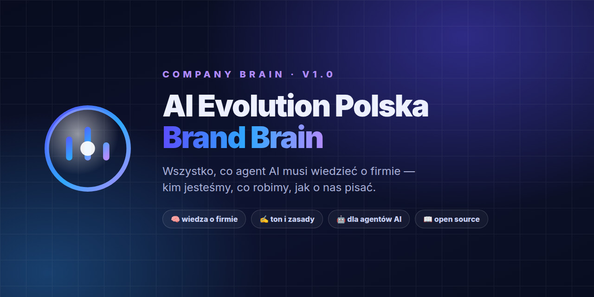

<div align="center">


# AI Evolution Polska | Company Brain

Kontekst firmy, z którego agent korzysta przed przygotowaniem treści, oferty lub procesu.

</div>

## Zacznij tutaj

Przekaż agentowi [COMPANY_BRAIN.md](COMPANY_BRAIN.md) i oryginalne materiały potrzebne
do zadania. W repo instrukcją wejścia jest [AGENTS.md](AGENTS.md).
Sklonowanie repo samo w sobie nie dowodzi przeczytania wiedzy.

```text
Przeczytaj COMPANY_BRAIN.md.
Przygotuj brief posta dla AI Evolution Polska o porządkowaniu wiedzy firmy.
Nie wymyślaj wyników. Oddziel szkic od informacji wymagających potwierdzenia.
```

## Co zawiera wersja 3.2

Tożsamość, oferta, odbiorcy, komunikacja, branding i procedury pracy.
Do tego START/research, mapa strony, content, obsługa zapytań, hipotezy SEO,
brief reklamowy, mapa systemów, definicje KPI i plan rozwoju.

Wersja 3.2 dodaje dane ze strony aievolutionpolska.pl: hasło „Sztuczna inteligencja
po polsku”, licznik społeczności 10 000+, zakres kursów i szkoleń oraz katalog
skilli open source. Wszystko ma status TO_CONFIRM. Cena Kursu PRO ma status
CONFLICT, dopóki właściciel jej nie potwierdzi.

To wiedza i procedury, nie uruchomione kampanie, crawler lub integracje.
Źródła, statusy i braki są jawne. Szablon metody nie jest dowodem faktów o firmie.

## Widoki tematyczne

[START](docs/START_HERE.md) · [oferta](docs/OFFER.md) · [głos](docs/VOICE.md) ·
[odbiorcy](docs/AUDIENCE.md) · [klienci](docs/CLIENTS.md) · [strategia](docs/STRATEGY.md) ·
[narzędzia](docs/TOOLS.md) · [strona](docs/WEBSITE.md) · [marketing](docs/MARKETING.md) ·
[sprzedaż](docs/SALES.md) · [SEO](docs/SEO.md) · [systemy](docs/SYSTEMS.md) · [plan](docs/PLANNING.md).

Widoki to generowane indeksy: prowadzą do sekcji głównego pliku i wskazują źródła.
Nie są odrębną bazą wiedzy. Nie edytuj ich ręcznie.
BRAND.md pozostaje pełną kopią dla starszych integracji. Skill ma pełny snapshot
w agent/references/COMPANY_BRAIN.md; przenoś cały katalog agent, nie sam SKILL.md.
Automatyczne rozpoznanie instrukcji zależy od używanego klienta i jego konfiguracji.

## Aktualizacja i testy

Edytuj COMPANY_BRAIN.md, następnie:
```bash
python3 scripts/brain.py build
python3 -m unittest discover -s tests -v
python3 scripts/brain.py check
python3 scripts/brain.py report
```

Python 3.10+; standardowa biblioteka, bez nowych usług i opłat.
Raport jest odczytem offline i pokazuje do pięciu pytań do właściciela.
Nie aktualizuje faktów i nie działa w tle. Check sprawdza strukturę, ścieżki,
eksporty i hashe assetów, nie prawdziwość biznesowych danych.

[Utrzymanie](docs/MAINTENANCE.md) · [audyt migracji](docs/AUDIT.md) ·
[adaptacja szablonu](docs/TEMPLATE_IMPLEMENTATION.md) · [testy](tests/README.md) ·
[zmiany](CHANGELOG.md).

Logo, baner i [licencja](LICENSE.md) pozostają bez zmian. Nie przenoś do
publicznego repo prywatnych danych klientów, sekretów i wewnętrznych wycen.
Niepotwierdzone warunki oferty nie są nowym publicznym cennikiem.
